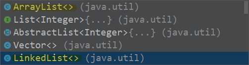

# 策略模式（整体替换原则）

### 介绍
#### 解决同一个问题会有多种算法，策略模式可以实现对算法的整体替换，\n能够让我们通过不同的算法，解决同一个问题。
#### 

对于list来说，ide就会多种实现，ArrayList&LinkedList...
### 构成要素
#### 
- 策略接口（定义算法中要实现哪些功能）
- 具体策略（多个）
- Context将策略接口封装起来，使得Main不直接接触策略接口